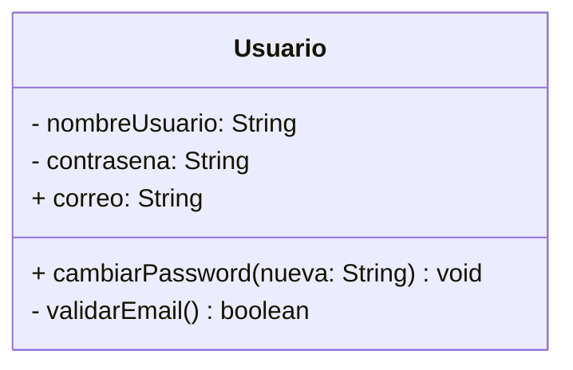
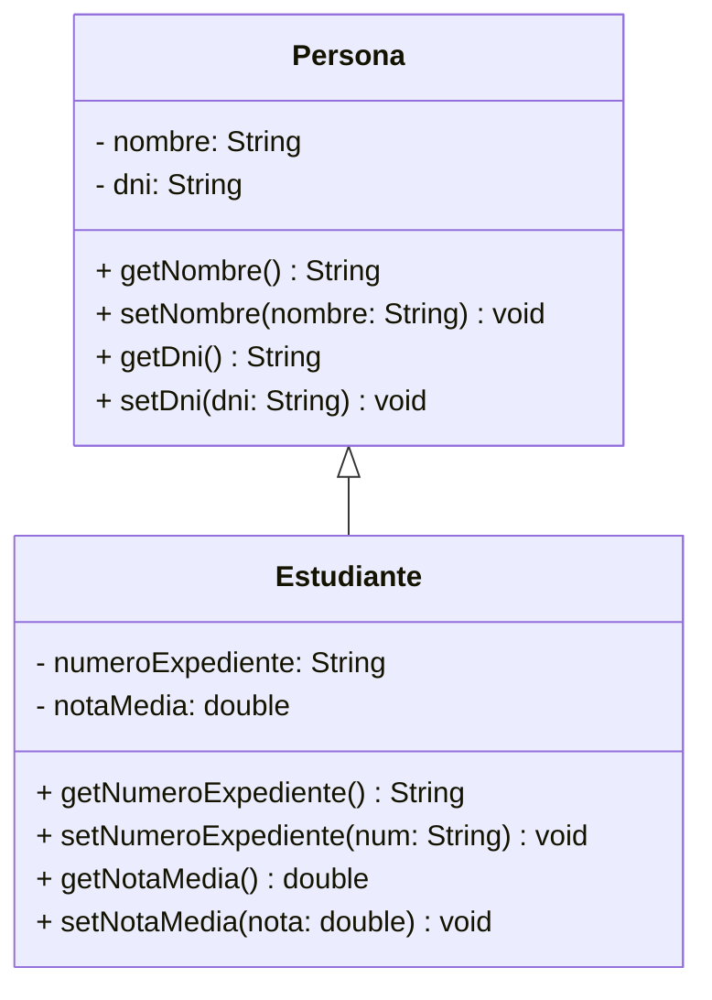
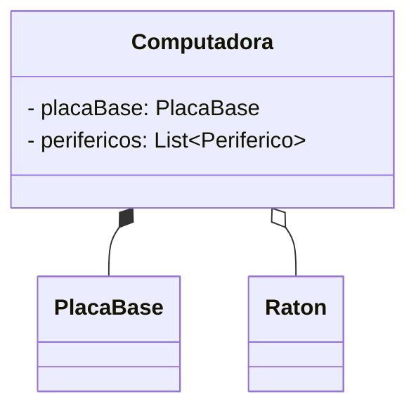
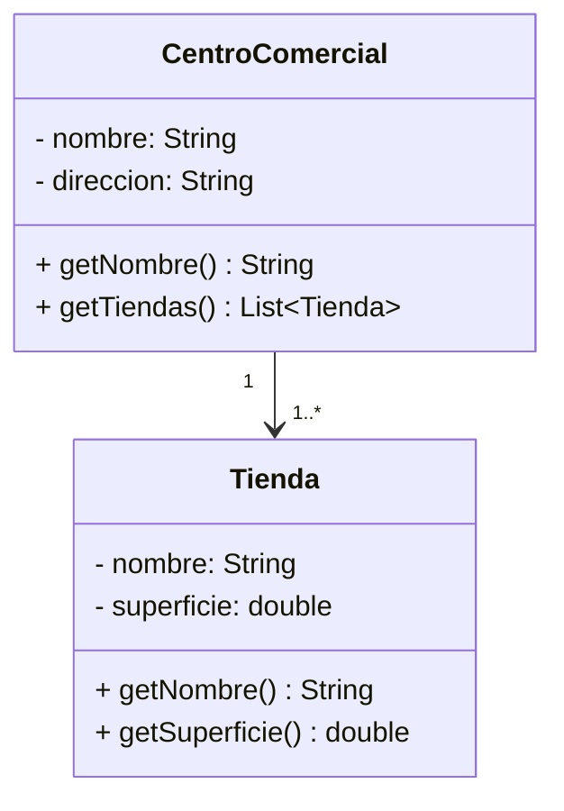
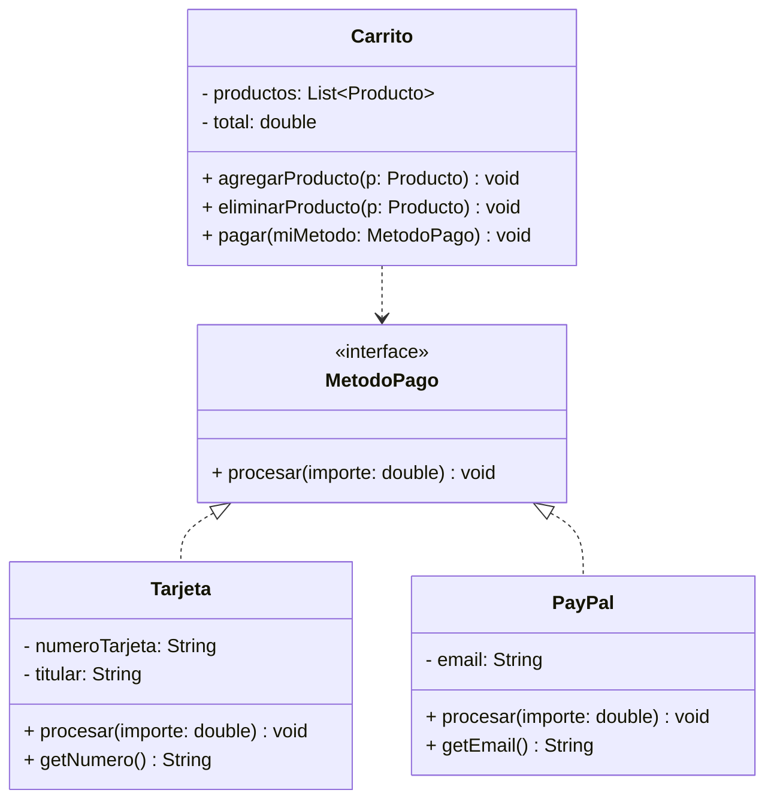

# 6.2. Batería de ejercicios de diagrama de clases

## Ejercicio 1 

**Supuesto:** Diseña una clase Usuario.

**Atributos:**

- nombre de usuario (privado)
- contraseña (privada)
- correo (público)

**Métodos:**

- cambiarPassword(String nueva) (público)
- validarEmail() (privado)

**Diagrama UML:**



---

## Ejercicio 2 

**Supuesto:** En un sistema escolar, tenemos Personas y Estudiantes.

Una Persona tiene nombre y DNI. Un Estudiante es una Persona, pero además tiene un numeroExpediente y una notaMedia.

**Diagrama UML:**



---

## Ejercicio 3 

**Supuesto:** Modelar una Computadora.

Una Computadora tiene una PlacaBase. Si la computadora se destruye, la placa base también se considera destruida (vínculo fuerte).

Una Computadora tiene periféricos como un Raton. Si la computadora desaparece, el ratón puede usarse en otra (vínculo débil).

**Diagrama UML:**



**Representación alternativa:**



---

## Ejercicio 4 

**Supuesto:** Un CentroComercial y sus Tiendas.

Un CentroComercial puede albergar de 1 a muchas tiendas. Cada Tienda pertenece exactamente a un CentroComercial.

**Diagrama UML:**


**Relación:** CentroComercial (1) ──── (1..*) Tienda

---

## Ejercicio 5 

**Supuesto:** Sistema de pagos.

Crea una interfaz MetodoPago con el método procesar(double importe). Las clases Tarjeta y PayPal deben implementar dicho contrato. La clase Carrito tiene un método pagar(MetodoPago miMetodo) (Uso puntual).

**Diagrama UML:**



---

## Ejercicio 6 

**Supuesto:** Sistema de Gestión de una Biblioteca Universitaria.

**Contexto:** La biblioteca necesita un sistema básico para gestionar sus recursos bibliotecarios y el préstamo a usuarios.

**Requisitos del diseño (UML):**

**Clase Recurso (Padre):**

- Atributos: id (int) y titulo (String), ambos privados.
- Métodos: prestar() y devolver(), ambos públicos.

**Clases Libro y Revista (Hijas):**

- Ambas son specializeaciones de Recurso.
- Libro tiene un atributo propio: isbn (String).
- Revista tiene un atributo propio: numeroEdicion (int).

**Clase Usuario:**

- Atributos: nombre (String) y numCarnet (int).

**Relación:** Un Usuario puede tener uno o varios Recurso prestados en un momento dado (1 a 0..*).

**Diagrama UML:**

```
┌─────────────────────────────┐
│          Recurso            │
├─────────────────────────────┤
│ - id: int                   │
│ - titulo: String            │
├─────────────────────────────┤
│ + prestar(): void           │
│ + devolver(): void          │
│ + getId(): int              │
│ + getTitulo(): String       │
└─────────────────────────────┘
                △
                │ inheritance
    ┌───────────┴───────────┐
    │                       │
┌──────────────┐ ┌─────────────────────┐
│    Libro     │ │    Revista          │
├──────────────┤ ├─────────────────────┤
│ - isbn:      │ │ - numeroEdicion     │
│   String     │ │   : int             │
├──────────────┤ ├─────────────────────┤
│ + getIsbn()  │ │ + getNumeroEdicion()│
│ + setIsbn()  │ │ + setNumeroEdicion()│
└──────────────┘ └─────────────────────┘

┌─────────────────────────────┐        0..*     ┌─────────────────────────────┐                 ┌─────────────────────────────┐                 |                             |
│           Usuario           │─────────────────│          Recurso            │
├─────────────────────────────┤    1            ├─────────────────────────────┤
│ - nombre: String            │◄────────────────│ - id: int                   │
│ - numCarnet: int            │   tiene         │ - titulo: String            │
├─────────────────────────────┤   prestados     ├─────────────────────────────┤
│ + getNombre(): String       │                 │ + prestar(): void           │
│ + setNombre(nombre: String) │                 │ + devolver(): void          │
│ + getNumCarnet(): int       │                 │ + getId(): int              │
│ + setNumCarnet(carnet: int) │                 │ + getTitulo(): String       │
│ + agregarRecurso(r: Recurso)│                 └─────────────────────────────┘
│ + eliminarRecurso(r: Recurso)│
└──────────────────────────────┘
```

---

## Resumen de relaciones UML utilizadas

| Ejercicio   | Tipo de relación      |                       Descripción                          |
|-------------|-----------------------|------------------------------------------------------------|
| Ejercicio 1 | Attributos            | Visibilidad: private (-) y public (+)                      |
| Ejercicio 2 | Herencia              | Generalización/Especialización (Estudiante hereda de       |      Persona)                                                                                           |
| Ejercicio 3 | Composición           | Vinculo fuerte (PlacaBase) y Agregación (Raton)            |   
| Ejercicio 4 | Asociación binaria    | Uno a muchos (CentroComercial → Tiendas)                   |
| Ejercicio 5 | Interfaz              | Implementación (Tarjeta, PayPal implementan MetodoPago)                                                                                        |
| Ejercicio 6 | Herencia + Asociación | Recurso (padre) → Libro/Revista (hijos) + Usuario (1..*)                                                                                                 |
